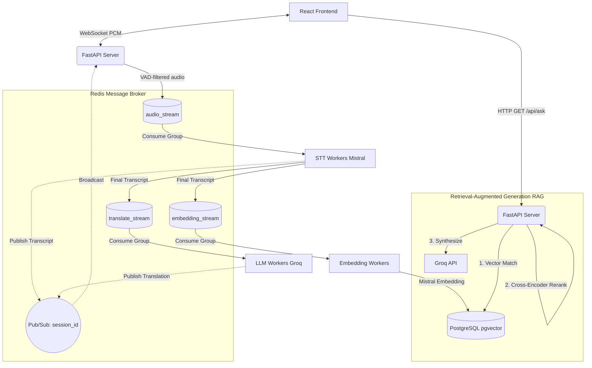
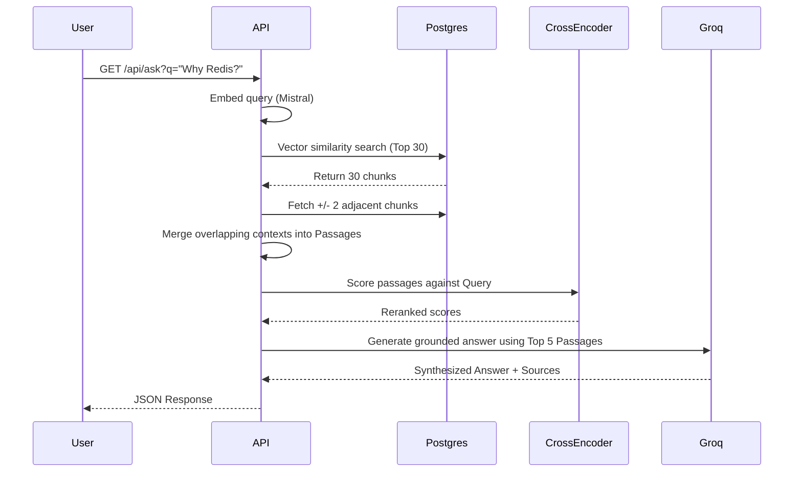

# System Architecture

This document describes the decoupled, microservices-based architecture of the Dual-Delay STT application.

## 1. High-Level Topology

The system uses **Redis Streams** to decouple the fast ingestion of audio from the heavy processing of transcription, translation, and embedding generation. This allows each worker type to scale independently.

## 2. Worker Roles

### FastAPI WebSocket Server
- Exposes `ws://localhost:8000/ws/transcribe`.
- Maintains the active WebSocket connection with the client.
- Runs a local Voice Activity Detection (VAD) gate to drop silence and only forward actual speech.
- Publishes voiced PCM chunks to the Redis `audio_stream`.
- Subscribes to the Redis Pub/Sub channel for the specific `session_id` and forwards results (transcripts, translations) back to the client.

### STT Worker (`worker_stt.py`)
- Consumes from `audio_stream`.
- Maintains a dual-delay Mistral STT connection (fast partials + slow confirmed).
- Runs hallucination suppression to filter out filler words (um, ah) and hallucinations.
- When speech finishes (via a silence event), it finalizes the text and publishes downstream to `translate_stream` and `embedding_stream`.

### LLM Worker (`worker_llm.py`)
- Consumes from `translate_stream`.
- Translates the confirmed transcript via the Groq API.
- Publishes translation status and the final translated text to the Redis Pub/Sub channel.

### Embedding Worker (`worker_embedding.py`)
- Consumes from `embedding_stream`.
- Generates 1024-dimensional semantic embeddings using the Mistral API.
- Upserts the vectors directly into the PostgreSQL database using `pgvector`.

### Cron Worker (`worker_cron.py`)
- Background maintenance loop.
- Hard-deletes abandoned or completed sessions older than 24 hours from PostgreSQL to save storage space.

## 3. Advanced RAG Pipeline (Semantic Search)

The API exposes an endpoint `GET /api/ask?q=...` which uses a mature RAG pipeline:

